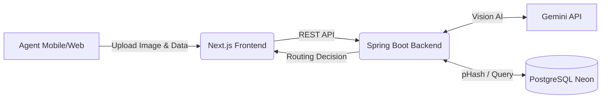

# Ripenly

> **AI-Powered Perishable Supply Chain Routing**

Ripenly is an intelligent B2B aggregation platform designed to tackle post-harvest agricultural loss in developing nations. By leveraging multimodal AI and predictive market forecasting, we dynamically route perishable goods to the optimal market before they spoil, securing higher realized value for rural farming cooperatives.

---

## The Problem
In fragmented supply chains, over 22% of perishable produce spoils in transit due to inefficient routing, blind dispatching, and lack of real-time quality tracking. Aggregators often send goods to saturated markets, resulting in crashing prices and massive post-harvest food waste.

## Our Solution
Ripenly transforms blind dispatch into data-driven routing:
1. **Multimodal Quality Grading:** Agents upload field photos which are instantly graded (A/B/C) using Gemini's vision AI.
2. **Dynamic ERV Engine:** We calculate the Expected Realized Value (ERV) by factoring in spoilage windows, transport distance, and real-time market demand.
3. **Fraud Defense:** We compute cross-session perceptual hashes (pHash) on all uploads to detect and soft-flag duplicate image submissions from fraudulent agents.

---

## Screenshots
*(Note to judges: Check out these live views of our platform in action)*


*Intelligent Market Routing & Gemini Vision Analysis*


*Live Agent Tracking & pHash Fraud Defense*


*ERV Alpha Calculations & Spoilage Window*

*(Please place your screenshots inside the `/docs/screenshots/` folder named `home.png`, `history.png`, and `result.png`)*

---

## Tech Stack
We built Ripenly using a modern, scalable, and fully type-safe architecture:

- **Frontend:** Next.js (v16.3.0), React (v19.2.8), TailwindCSS (v4)
- **Backend:** Spring Boot (v4.1.0), Java 21, JImageHash (v1.0.0)
- **Database:** PostgreSQL (Hosted on Neon)
- **AI / LLM:** Google Gemini Multimodal API
- **Deployment:** Render (Frontend & Backend)

---

## Architecture Flow



---

## Setup Instructions (Local Development)

### 1. Prerequisites
- Node.js (v20+)
- Java 21 & Maven
- A Neon PostgreSQL Database
- Google Gemini API Key

### 2. Environment Variables
You will need to set up the following environment variables (do not commit actual values):

**Backend (`backend/.env`):**
```env
DB_URL=jdbc:postgresql://your-neon-host...
DB_USER=your_neon_user
DB_PASSWORD=your_neon_password
GEMINI_API_KEY=your_gemini_key
GEMINI_API_KEY_BACKUP=your_gemini_key_backup
```

**Frontend (`frontend/.env.local`):**
```env
NEXT_PUBLIC_API_URL=http://localhost:8080
```

### 3. Running the Backend
```bash
cd backend
./mvnw clean install
./mvnw spring-boot:run
```
*(The backend will start on `http://localhost:8080`)*

### 4. Running the Frontend
```bash
cd frontend
npm install
npm run dev
```
*(The frontend will start on `http://localhost:3000`)*

---

## Live Demo
The application is fully deployed and live!

**[View Ripenly Live (Render)](#)** *(Replace this with the actual Render frontend URL once confirmed)*

---

## License & Team
**Team:** Ripenly  
*Built for the AI Ideathon 2026*
